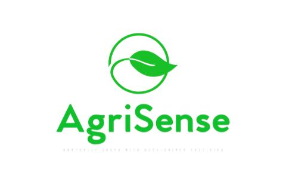

# 🌾 Crop-Fertilizer-Recommendation-System-web-demo

A responsive **HTML, CSS, JavaScript** based web demo for recommending crops and fertilizers. The project simulates a modern agricultural web interface with login/logout functionality, form validation, and a sleek user interface.

---

## ✨ Features

- **Searchable Interface** – Includes UI for selecting crop or fertilizer recommendation.
- **Login & Register Forms** – Simulated authentication system with form validation.
- **Modern UI/UX** – Styled using custom CSS with responsiveness and animations.
- **Mobile-Friendly** – Includes media queries for full responsiveness across devices.
- **Custom Look** – Styled with a clean green agricultural theme and glassmorphism effects.

---

## 🛠 Technologies Used

- **HTML5** – Structure and content
- **CSS3** – Styling and layout (with responsiveness)
- **JavaScript (ES6)** – DOM interaction and form logic
- **Ionicons** – Icon pack for UI
- **Vanilla JS** – No frameworks required

---

## 📁 File Structure

Crop-Fertilizer-Recommendation-System-web/

│

├── about.html # Webpage (includes login, register, logout modals)

├── contact.html # Webpage (includes login, register, logout modals)

├── image.jpg # Site image (used in background)

├── index.html # Webpage (includes login, register, logout modals, and crop recommendation, fertilizer recommendation modals)

├── logo.jpeg # Site logo (used in header, favicon)

├── script.js # JavaScript logic (form handling, toggles)

└── style.css # CSS styling (responsive + animations)
